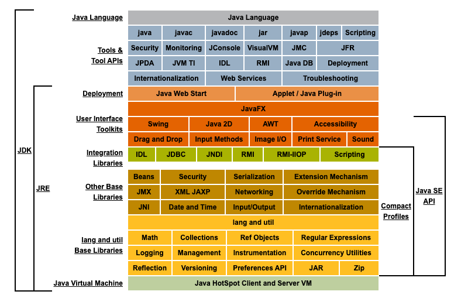

##  Q1: JDK和JRE的区别？
> [From Zhihu](https://www.zhihu.com/question/20317448/answer/14737358)

- JRE： Java Runtime Environment
- JDK：Java Development Kit 
- JRE顾名思义是java运行时环境，包含了java虚拟机，java基础类库。是使用java语言编写的程序运行所需要的软件环境，是提供给想运行java程序的用户使用的。
- JDK顾名思义是java开发工具包，是程序员使用java语言编写java程序所需的开发工具包，是提供给程序员使用的。JDK包含了JRE，同时还包含了编译java源码的编译器javac，还包含了很多java程序调试和分析的工具：jconsole，jvisualvm等工具软件，还包含了java程序编写所需的文档和demo例子程序。

 

## Q2: 什么是Java泛型的类型擦除？
Java 的泛型是伪泛型，这是因为 Java 在编译期间，所有的泛型信息都会被擦掉，这也就是通常所说类型擦除 。 更多关于类型擦除的问题，可以查看这篇文章：[Java泛型类型擦除以及类型擦除带来的问题](https://www.cnblogs.com/wuqinglong/p/9456193.html)