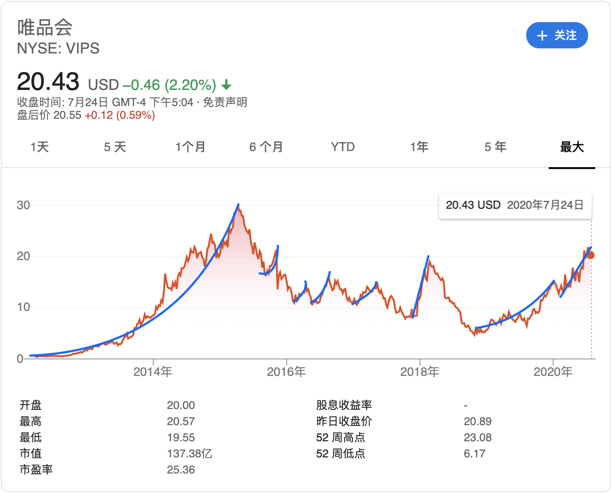

# p122-买卖股票的最佳时机 II
## 题目来源
https://leetcode-cn.com/problems/best-time-to-buy-and-sell-stock-ii/
## 题目描述

给定一个数组，它的第 i 个元素是一支给定股票第 i 天的价格。

设计一个算法来计算你所能获取的最大利润。你可以尽可能地完成更多的交易（多次买卖一支股票）。

注意：你不能同时参与多笔交易（你必须在再次购买前出售掉之前的股票）。

 

示例 1:
```text
输入: [7,1,5,3,6,4]
输出: 7
解释: 在第 2 天（股票价格 = 1）的时候买入，在第 3 天（股票价格 = 5）的时候卖出, 这笔交易所能获得利润 = 5-1 = 4 。
     随后，在第 4 天（股票价格 = 3）的时候买入，在第 5 天（股票价格 = 6）的时候卖出, 这笔交易所能获得利润 = 6-3 = 3 。
```

示例 2:
```text
输入: [1,2,3,4,5]
输出: 4
解释: 在第 1 天（股票价格 = 1）的时候买入，在第 5 天 （股票价格 = 5）的时候卖出, 这笔交易所能获得利润 = 5-1 = 4 。
     注意你不能在第 1 天和第 2 天接连购买股票，之后再将它们卖出。
     因为这样属于同时参与了多笔交易，你必须在再次购买前出售掉之前的股票。
```

示例 3:
```text
输入: [7,6,4,3,1]
输出: 0
解释: 在这种情况下, 没有交易完成, 所以最大利润为 0。
 ```

提示：
```text
1 <= prices.length <= 3 * 10 ^ 4
0 <= prices[i] <= 10 ^ 4
```
## 核心知识
峰谷法
## 解题思路
按照炒股的正常思维，只有把股票的每一次上涨都落袋为安，才能实现收益最大化。从图形上看，其实就是把所有的上升浪都计算进收益中:




实现如下
```java
    public int maxProfit(int[] prices) {
        if (prices == null || prices.length <= 1) {
            return 0;
        }

        int maxProfit = 0;
        for (int index = 1; index < prices.length; index++) {
            if (prices[index] > prices[index - 1]) {
                maxProfit += (prices[index] - prices[index - 1]);
            }
        }

        return maxProfit;
    }

```
## 其他补充
股票买卖类型题目：
- [p121-买卖股票的最佳时机](../problem/p121-best-time-to-buy-and-sell-stock.md)
- [p122--买卖股票的最佳时机 II](../problem/p122-best-time-to-buy-and-sell-stock-ii.md)
- [p123-买卖股票的最佳时机 III](../problem/p123-best-time-to-buy-and-sell-stock-iii.md)
- [p188-买卖股票的最佳时机 IV](../problem/p188-best-time-to-buy-and-sell-stock-iv.md)
- [p714-买卖股票的最佳时机含手续费](../problem/p714-best-time-to-buy-and-sell-stock-with-transaction-fee.md)
- [p309-最佳买卖股票时机含冷冻期](../problem/p309_best-time-to-buy-and-sell-stock-with-cooldown.md)