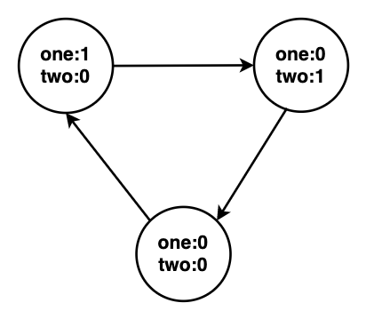

# p137_只出现一次的数字2
## 题目描述

给定一个非空整数数组，除了某个元素只出现一次以外，其余每个元素均出现了三次。找出那个只出现了一次的元素。 

 说明： 

 你的算法应该具有线性时间复杂度。 你可以不使用额外空间来实现吗？ 

 示例 1: 
```
 输入: [2,2,3,2]
 输出: 3
```
 

 示例 2: 
```
 输入: [0,1,0,1,0,1,99]
 输出: 99 
```


## 题目难度
> ★★★★★
## 核心知识

## 解题思路
这道题类似[p136_只出现一次的数字](../problem/p136_只出现一次的数字.md)。

但位运算的思路很难想，还是看看官方题解吧（虽然题解也很含糊）。

这种解法本质上是一个状态机思想，状态转移图如下：





掌握了这个状态机思想，很多类似的题目都可以解决。包括p136。


```java
public int singleNumber(int[] nums) {
    int one = 0, two = 0;

    for (int num : nums) {
        one = ~two & (one ^ num);
        two = ~one & (two ^ num);
    }

    return one;
}
```

## 其他补充

- [p136_只出现一次的数字](../problem/p136_只出现一次的数字.md)
