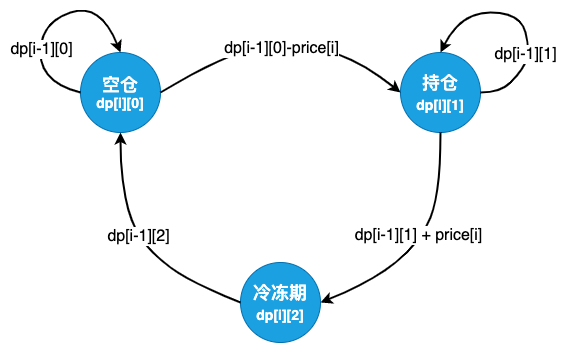

# p309-最佳买卖股票时机含冷冻期
## 题目来源
https://leetcode-cn.com/problems/best-time-to-buy-and-sell-stock-with-cooldown/
## 题目描述

给定一个整数数组，其中第 i 个元素代表了第 i 天的股票价格 。​

设计一个算法计算出最大利润。在满足以下约束条件下，你可以尽可能地完成更多的交易（多次买卖一支股票）:

你不能同时参与多笔交易（你必须在再次购买前出售掉之前的股票）。
卖出股票后，你无法在第二天买入股票 (即冷冻期为 1 天)。
示例:
```text
输入: [1,2,3,0,2]
输出: 3 
解释: 对应的交易状态为: [买入, 卖出, 冷冻期, 买入, 卖出]
```
## 核心知识

动态规划、状态剪枝

## 解题思路
这道问题比[**p741-买卖股票的最佳时机含手续费**](p714-best-time-to-buy-and-sell-stock-with-transaction-fee.md)更复杂一些。每一天的状态分为了空仓、持仓和冷冻期三种状态。其状态转移图如下：


从状态图可以总结出状态转移方程：

$$ 
\begin{cases}
dp[0][0] = 0,\ dp[0][1] = -prices[0], \ dp[0][2] = 0; \\\\
dp[i][0]=max(dp[i - 1][0] , dp[i - 1][2]); \\\\
dp[i][1]=max(dp[i - 1][0] - price[i], dp[i-1][1]); \\\\
dp[i][2]=dp[i-1][1] + price[i].
\end{cases}
$$

于是得到代码如下：

```java
    public int maxProfit(int[] prices) {
        if (prices == null || prices.length <= 1) {
            return 0;
        }

        int n = prices.length;

        int dp[][] = new int[n][3];
        dp[0][0] = 0;
        dp[0][1] = -prices[0];
        dp[0][2] = 0;

        for (int i = 1; i < n; i++) {
            dp[i][0] = Integer.max(dp[i - 1][0], dp[i - 1][2]);
            dp[i][1] = Integer.max(dp[i - 1][0] - prices[i], dp[i - 1][1]);
            dp[i][2] = dp[i - 1][1] + prices[i];
        }

        return Integer.max(Integer.max(dp[n - 1][0], dp[n - 1][1]), dp[n - 1][2]);
    }

```

显而易见 *dp[i][0..2]* 只和 *dp[i-1][0..2]* 有关，因此可以进行空间压缩：

```java
    public int maxProfitCompress(int[] prices) {
        if (prices == null || prices.length <= 1) {
            return 0;
        }

        int n = prices.length;

        int empty = 0; // dp[0][0] = 0;
        int hold = -prices[0]; // dp[0][1] = -prices[0];
        int freeze = 0; // dp[0][2] = 0;

        for (int i = 1; i < n; i++) {
            int nextEmpty = Integer.max(empty, freeze);
            int nextHold = Integer.max(empty - prices[i], hold);
            int nextFreeze = hold + prices[i];

            empty = nextEmpty;
            hold = nextHold;
            freeze = nextFreeze;
        }

        return Integer.max(Integer.max(empty, hold), freeze);
    }

```


## 其他补充

股票买卖类型题目：
- [p121-买卖股票的最佳时机](p121-best-time-to-buy-and-sell-stock.md)
- [p714-买卖股票的最佳时机含手续费](p714-best-time-to-buy-and-sell-stock-with-transaction-fee.md)
- [p309-最佳买卖股票时机含冷冻期](p309_best-time-to-buy-and-sell-stock-with-cooldown.md)

